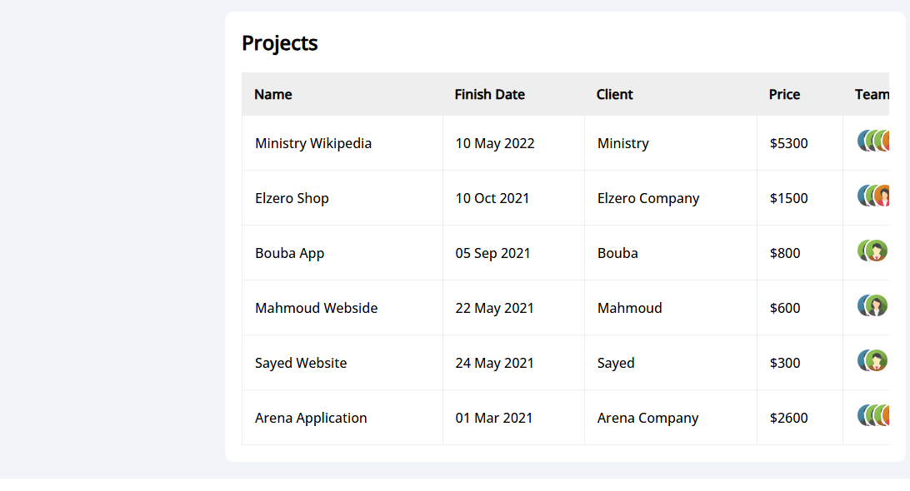

# Dashboard

## This Template About Html, Css, Javascript

## Who am i ?

I'm Ahmed Magdy, I'm Front-End Developer.

## What technology is used here?

I used Html, css, fontawesome for icons and javascript. This Template is responsive on all screens.

## Site Review

### Main Page

### Settings Page

### Profile Page

### Projects Page

### Courses Page

### Friends Page

### Files Page

### Plans Page

## Links

- Facebook
  https://www.facebook.com/profile.php?id=100085749470017

- X
  https://twitter.com/ahmed_magdy135
